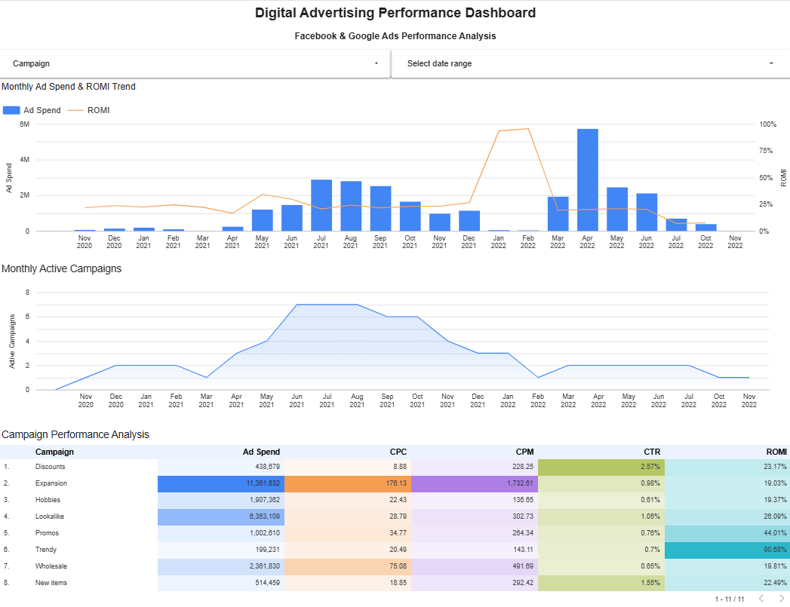

# 📊 Digital Advertising Performance Dashboard

## Project Overview

This project analyzes digital advertising performance across Facebook Ads and Google Ads.

Advertising data was prepared and aggregated using PostgreSQL and SQL, then connected to Looker Studio to build an interactive performance dashboard.

The dashboard allows users to monitor advertising spend, campaign activity, and marketing performance through key metrics such as CPC, CPM, CTR, and ROMI.

## 🛠 Tools & Technologies

- PostgreSQL
- SQL
- Looker Studio
- Facebook Ads Data
- Google Ads Data

## 📌 Key Metrics

- **Ad Spend** – Total advertising expenditure
- **CPC (Cost Per Click)** – Advertising cost per click
- **CPM (Cost Per Mille)** – Cost per 1,000 impressions
- **CTR (Click-Through Rate)** – Percentage of impressions that resulted in clicks
- **ROMI (Return on Marketing Investment)** – Return generated from marketing spend

## 📈 Dashboard

The dashboard includes:

- Monthly Ad Spend & ROMI trend analysis
- Monthly active campaign tracking
- Campaign-level performance comparison
- Heatmap-based KPI visualization
- Campaign and date range filters for interactive analysis

## 🔍 SQL Data Preparation

Facebook Ads and Google Ads data were combined using SQL.

The data preparation process includes:

- Joining Facebook campaign and ad set tables
- Combining Facebook Ads and Google Ads using `UNION ALL`
- Aggregating advertising metrics
- Grouping performance by date, media source, campaign, and ad set

The SQL query used for the analysis is available here:

[`sql/advertising_analysis.sql`](sql/advertising_analysis.sql)

## 🎯 Business Questions

This dashboard was designed to answer questions such as:

- How does advertising spend change over time?
- How does ROMI change alongside advertising spend?
- How many campaigns are active each month?
- Which campaigns have the highest advertising costs?
- Which campaigns generate stronger marketing returns?
- How do CPC, CPM, CTR, and ROMI differ between campaigns?

## 📁 Project Structure

    digital-advertising-performance-dashboard/
    ├── dashboard/
    │   └── digital-advertising-dashboard.png
    ├── sql/
    │   └── advertising_analysis.sql
    └── README.md